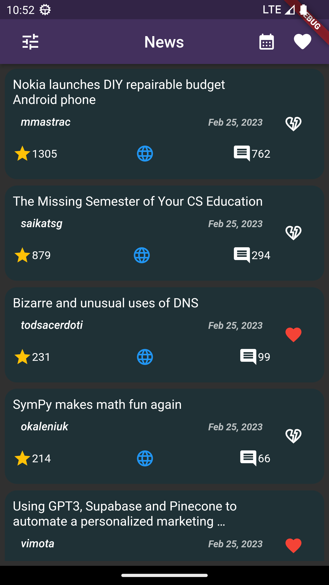
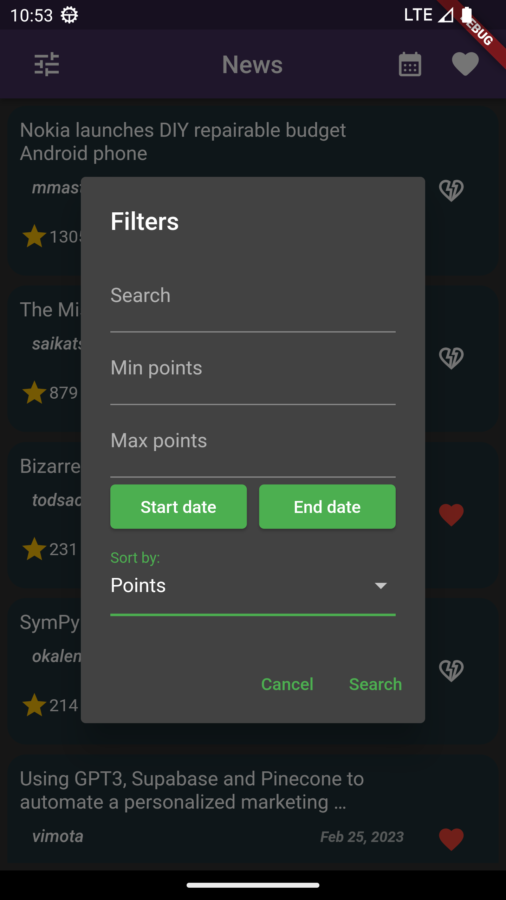
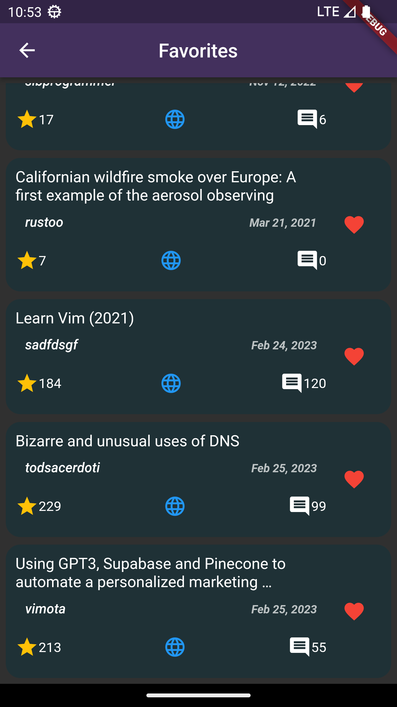

## Awesome News

An application which displays a list of news from [Heacker News Algolia](https://hn.algolia.com/).

## Task requirements:
- a main page displaying the list of news by using https://hn.algolia.com/api/v1/search?tags=front_page API
- display: Title, Publish date, Author, Number of comments, Number of points
- the ability to mark a news as favorite and save it (locally) using the package shared_preferences (https://pub.dev/packages/shared_preferences)
- you can access favorite news in a different page, from where they can be removed
- you can open each news in an external browser 🌐
- ability to filter news from the main page by:
    - search key word in the title
    - filter by number of points and published date (range)
    - sort by number of points and published date
- the option to display news only from a specific day
- make reusable components
---
## Technical details:
- Flutter SDK 3.3.6 
- multi-platform application (Web, Android, iOS, Windows, Mac, Linux)
- Download executable app for windows <a href="./docs/awesome_news_win.zip" download>Download</a>
- source code is inside __lib__ folder
---
 

